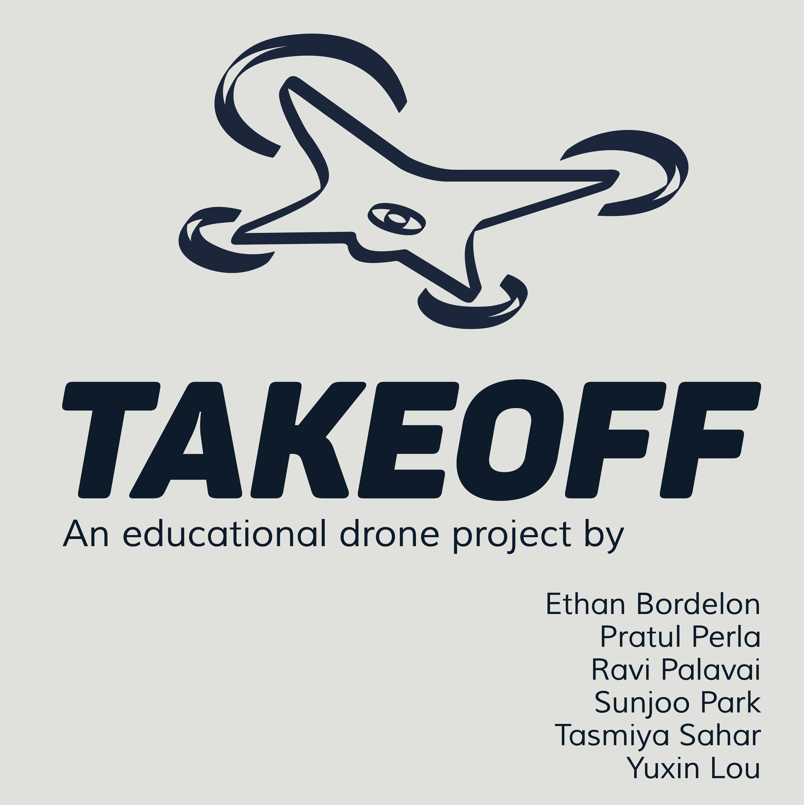

# Project Takeoff

An educational drone project that teaches geometry and flight planning through a guided command workflow.



## Overview

Project Takeoff is a prototype system built around the **DJI Tello SDK** to help students learn STEM concepts with drones.

Instead of directly piloting a drone with joysticks, users:
- connect to the drone,
- define safe flight boundaries,
- select a geometric path (line, triangle, square, etc.),
- validate commands,
- and execute a structured command sequence.

This project combines **learning + safety + programming** in one workflow.

## Project Goals

- Make drone flight more approachable for beginners.
- Teach geometry using real path execution.
- Enforce boundary-aware flight planning before running commands.
- Provide command logs that explain what the drone is doing.

## Key Features

- **Tello SDK command control** over UDP (`192.168.10.1:8889`)
- **Shape-based path planning** (line, triangle, square, polygon ideas)
- **Boundary setup concepts** (circle or rectangle-style constraints)
- **Command list abstraction** for sequencing and replay
- **Wireframed UI flow** for connect -> configure -> run -> logs

## Repository Contents

This folder includes:

- `droneConnection (1).py`
  Basic Python script to connect and send Tello SDK commands from terminal.
- `Drone Project.zip`
  Early prototype code, including a PyQt UI skeleton and command-list classes.
- `wireframes.bmpr` and `wf.pdf`
  UX wireframes (Balsamiq export) for app flow.
- `Project Takeoff prototype.pdf`
  Higher-fidelity prototype screens.
- `Tello SDK 2.0 User Guide.pdf`
  Command reference used for integration.
- `art/`
  Branding and cover assets.

## How It Works (Conceptual Flow)

1. **Connect** to Tello Wi-Fi.
2. Send `command` to enter SDK mode.
3. Select boundary type and parameters.
4. Choose flight path shape.
5. Convert path to command sequence (`forward`, `cw`, etc.).
6. Validate path and height limits.
7. Execute and log actions.

## Quick Start (Terminal Command Script)

### 1) Prerequisites

- Python 3.8+
- A DJI Tello drone
- Computer connected to the Tello Wi-Fi network

### 2) Run

```bash
python "droneConnection (1).py"
```

### 3) In the prompt, send commands:

```text
command
takeoff
forward 50
cw 90
land
end
```

`end` closes the socket and exits.

## Running the UI Prototype (Optional)

The PyQt prototype exists inside `Drone Project.zip`.

1. Extract `Drone Project.zip`
2. Install dependency:

```bash
pip install PyQt5
```

3. Run:

```bash
python "Drone Project/src/takeoff.py"
```

Note: this is a prototype build and some flows are incomplete.

## Example Shape Program (Triangle)

```text
command
takeoff
forward 100
cw 120
forward 100
cw 120
forward 100
land
```

## Current Status

This project is in **prototype stage**:
- UI/UX direction and command architecture are established.
- Core drone command communication works.
- Some validation and boundary math logic still needs hardening for production-grade reliability.

## Known Limitations

- Not production-ready for autonomous flight in uncontrolled environments.
- Boundary checking logic is partial in the current prototype code.
- Minimal telemetry/error recovery in current scripts.

## Future Improvements

- Complete and verify boundary-validation engine.
- Add robust command safety checks and constraints.
- Integrate telemetry feedback and richer execution logs.
- Publish a cleaned web-based simulator for demonstrations.

## Team

Project branding assets list the team as:
- Ethan Bordelon
- Pratul Perla
- Ravi Palavai
- Sunjoo Park
- Tasmiya Sahar
- Yuxin Lou

## Safety Note

Always test in open space with low altitude, clear surroundings, and local safety compliance.
This repository is for educational/prototyping purposes and should be used responsibly.

## Reference

- DJI/Ryze Tello SDK 2.0 User Guide (included in this repository)

